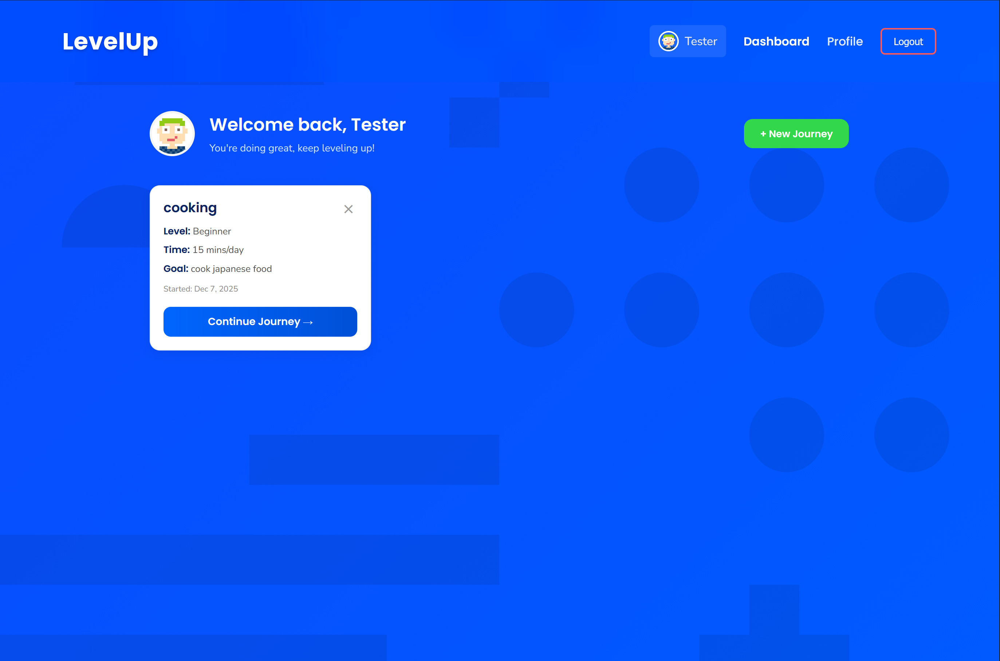
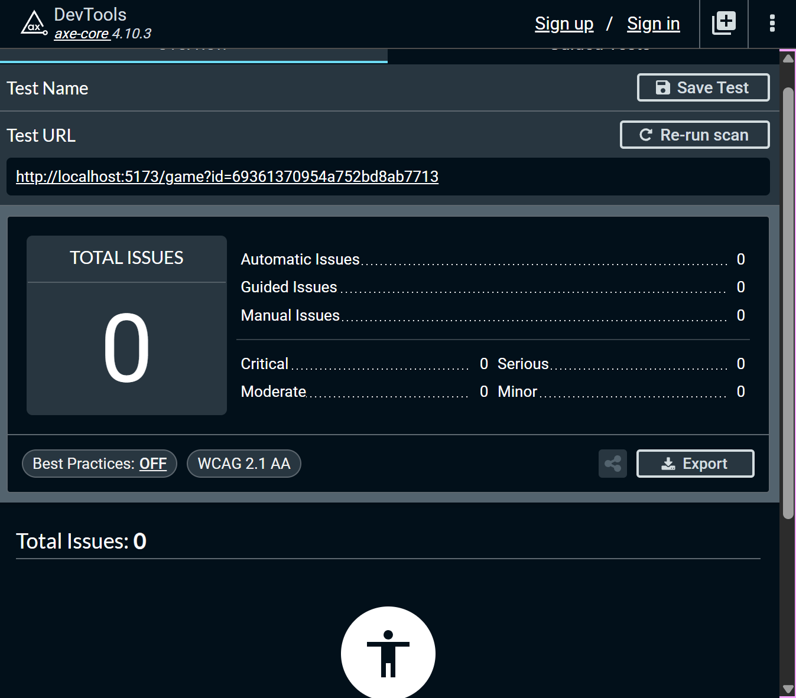
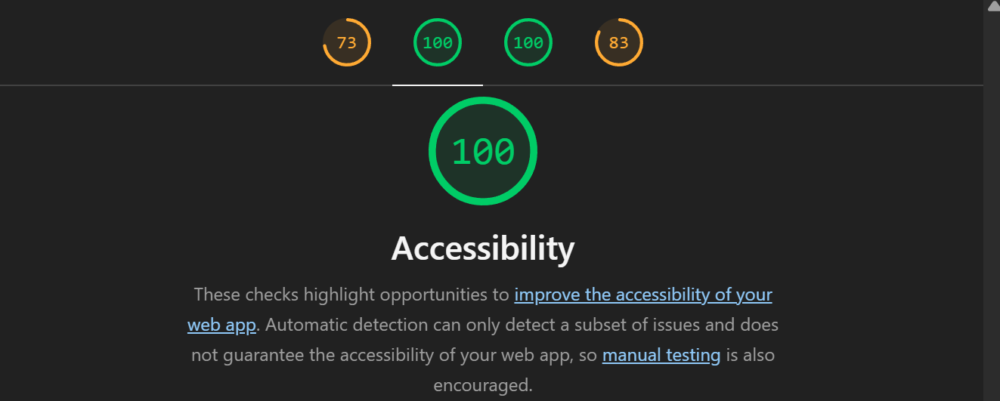

# LevelUp AI-Powered Skill Journey Tracker

**Web Development Final Project — Northeastern University**

---

## 📌 Author & Class Info

- **Authors:** Hemang Murugan & Adrian Halgas
- **Class:** Web Development — Northeastern University
- **Date:** [UPDATE DATE]
- [Class Link](https://johnguerra.co/classes/webDevelopment_online_fall_2025/)

---

# 🎯 Project Objective

**An AI-Powered Skill Journey Tracker and Adaptive Learning App**

**LevelUp** is a full-stack web application where users can create learning journeys to master new skills. The app uses **Google Gemini AI** to generate personalized challenges (quests) that evolve based on the user's progress and feedback.

This project is built using **Node + Express**, **MongoDB**, and **React (Hooks)**. The backend manages CRUD operations for users and learning journeys, while the frontend dynamically renders progress using client-side rendering.

---

## 🎥 Presentation & Demo Links

🔗 [Presentation Slides](https://docs.google.com/presentation/d/13WzqNQzLpnENGSOkwMHN669cdew9TD9IsD3RQ0g_LS8/edit?usp=sharing)

🔗 [Video Demo](https://youtu.be/WGn3qz9C2rg)

🔗 [Usability Study Report]([INSERT LINK])

---

## 🛠️ Instructions to Build / Run

### Prerequisites

- **Node.js** (v18 or later)
- **MongoDB Atlas** or local Mongo instance
- **Git** (for cloning)
- **Render** (for deployment)

### Steps

1. **Clone the repository**
```bash
   git clone https://github.com/iamtheretronerd/Web-dev-Project-3.git
   cd Web-dev-Project-3
```

2. **Backend setup**
```bash
   npm install
   npm run start
   # or
   npm run dev
```

3. **Frontend setup**
```bash
   cd ../frontend
   npm install
   npm run dev
```

4. **Environment variables**

   Create `.env` files in both backend and frontend folders.

   **Backend (.env)**
```env
   MONGODB_URI=<your MongoDB URI>
   PORT=3001
   GEMINI_API_KEY=<gemini api key>
```

   **Frontend (.env)**
```env
   VITE_API_URL=https://levelupfinal.onrender.com
```

5. **Access the app**
   - Local Development: [http://localhost:5173](http://localhost:5173)
   - Deployment: [https://levelupfinal.onrender.com](https://levelupfinal.onrender.com)

---

## 📸 Screenshot



---

## 🎨 Design System

### Color Palette

| Color | Hex Code | Usage |
|-------|----------|-------|
| Primary Blue | `#0066ff` | Primary actions, links, focus states |
| Primary Blue Dark | `#0050d6` | Button hover states, gradients |
| Success Green | `#32d74b` | Confirm actions, "Start Journey" button |
| Success Green Dark | `#28c043` | Success button hover states |
| Error Red | `#c62828` | Error messages, validation errors |
| Text Dark | `#0a2463` | Headings, titles |
| Text Medium | `#444`, `#555` | Body text, labels |
| Text Light | `#666`, `#888` | Subtitles, hints |
| Background Light | `#f8f9fa`, `#fafafa` | Page backgrounds, input backgrounds |
| White | `#ffffff` | Cards, modals |

### Typography

| Font Family | Weight | Usage |
|-------------|--------|-------|
| **Poppins** | 700 | Headings, titles, logo |
| **Poppins** | 600 | Button text, labels |
| **Poppins** | 500 | Navigation, subtitles |
| **Nunito** | 400-600 | Body text, inputs, descriptions |

### Consistent Button Colors

- **Primary Actions (Blue):** Login, Submit, Continue
- **Success Actions (Green):** Create Journey, Start Journey, New Journey
- **Danger Actions (Red):** Delete, displayed on hover

---

## ♿ Accessibility Features

This application is fully accessible and can be operated entirely with a keyboard:

- **Skip Links:** Allow keyboard users to skip to main content
- **Focus Management:** Visible focus indicators on all interactive elements
- **ARIA Labels:** Comprehensive labeling for screen readers
- **Semantic HTML:** Proper use of landmarks, headings, and form elements
- **Error Announcements:** Live regions announce errors to screen readers
- **Reduced Motion:** Respects `prefers-reduced-motion` user preference
- **High Contrast:** Supports `prefers-contrast: high` and forced colors mode
- **Keyboard Navigation:** All features accessible via Tab, Enter, Space, and Escape keys

### Lighthouse/Axe Accessibility Score

 

---

## 📋 Assignment Rubric Checklist

### Core Requirements

| **Criterion** | **Pts** | **Status** | **Evidence** |
|:--------------|:-------:|:----------:|:-------------|
| Does the app accomplish all approved requirements? | 15 | ✅ | [Live App](https://levelupfinal.onrender.com) |
| Is the app usable? Includes instructions? | 5 | ✅ | Detailed instructions in README |
| Is the app actually useful? | 5 | ✅ | Gamifies learning with AI feedback |
| ESLint config (no errors) | 5 | ✅ | [eslint.config.js](./eslint.config.js) |
| Code properly organized | 5 | ✅ | Components, routes, styles separated |
| Implements ≥3 React Components | 15 | ✅ | 7 components with hooks |
| Project deployed publicly & functional | 5 | ✅ | [Deployed App](https://levelupfinal.onrender.com) |
| Uses ≥2 Mongo Collections with CRUD | 15 | ✅ | `users`, `gameData`, `levels` |
| Database populated with ≥1k records | 10 | ✅ | [Verify](https://levelupfinal.onrender.com/api/levels/count) |
| Uses Node + Express | 5 | ✅ | [backend.js](./backend/backend.js) |
| Code formatted with Prettier | 5 | ✅ | `.prettierrc` applied |
| No non-standard HTML tags | 5 | ✅ | Semantic tags only |
| CSS organized by Modules | 5 | ✅ | [frontend/src/styles](./frontend/src/styles) |
| Clear and descriptive README | 10 | ✅ | This document |
| No exposed credentials | 10 | ✅ | `.env` in `.gitignore` |
| Includes package.json | 5 | ✅ | Backend & Frontend package.json |
| Uses MIT license | 5 | ✅ | [LICENSE](./LICENSE) |
| No leftover code | 5 | ✅ | Cleaned up |
| Google Form submission correct | 5 | ✅ | Yes |
| Short public narrated video demo | 10 | ✅ | [Video](https://youtu.be/WGn3qz9C2rg) |
| Code frozen 24h before class | 5 | ✅ | Done |

### Design & Accessibility Requirements

| **Criterion** | **Pts** | **Status** | **Evidence** |
|:--------------|:-------:|:----------:|:-------------|
| Defines PropTypes for every React Component | 5 | ✅ | All components have PropTypes |
| Implements hierarchy of design (important elements salient, top-left) | 5 | ✅ | Logo top-left, primary actions prominent |
| Everything properly aligned and spaced | 10 | ✅ | Consistent spacing, grid layouts |
| Consistent color palette aligned with app purpose | 10 | ✅ | Blue (action), Green (success), Red (error) |
| Adequate typography (font matching, non-default fonts) | 10 | ✅ | Poppins (headings) + Nunito (body) |
| Whole application usable with keyboard | 10 | ✅ | Full keyboard navigation, skip links |
| Passes accessibility tests (Axe/Lighthouse) | 10 | ✅ |   |
| Usability study report (3 participants per member) | 30 | ✅ | [Hemang Murugan](https://docs.google.com/document/d/1B6IVxViOkxoBFwdxcmfUf1vBoS5iJO2ZVPb8aDqkxZg/edit?usp=sharing) - [Adrian Halgas]()|
| Semantic HTML element order | 5 | ✅ | Proper landmarks and heading hierarchy |
| Top 3 of class (TA evaluation) | 20 | — | Pending evaluation 🤞|

---

## 🗂️ Project Structure
```
Web-dev-Project-3/
├── backend/
│   ├── routes/
│   │   ├── auth.js
│   │   ├── gameData.js
│   │   └── levels.js
│   ├── db/
│   │   └── myMongoDB.js
│   ├── backend.js
│   └── package.json
├── frontend/
│   ├── src/
│   │   ├── components/
│   │   │   ├── pages/
│   │   │   │   ├── Login.jsx
│   │   │   │   ├── Signup.jsx
│   │   │   │   ├── Dashboard.jsx
│   │   │   │   ├── Game.jsx
│   │   │   │   ├── CreateJourney.jsx
│   │   │   │   └── Profile.jsx
│   │   │   └── Navigation.jsx
│   │   ├── styles/
│   │   │   ├── login.module.css
│   │   │   ├── signup.module.css
│   │   │   ├── dashboard.module.css
│   │   │   ├── game.module.css
│   │   │   ├── createJourney.module.css
│   │   │   └── navigation.module.css
│   │   └── App.jsx
│   └── package.json
├── submissions/
│   ├── screenshot.png
│   ├── designdocument.pdf
│   └── usability-study.pdf
├── LICENSE
└── README.md
```

---

## 🧠 GenAI Usage

This project used **GenAI tools** (ChatGPT / Claude) for:

- Brainstorming, code reviews, and documentation refinement
- Implementing accessibility features (ARIA labels, keyboard navigation)
- Validating semantic HTML and ESLint/Prettier consistency
- Designing consistent color palette and typography system

**Sample Prompts Used:**

> "Review my code file for semantic structure, accessibility issues, and best practices."


**AI-Generated Level Prompt (used in API):**

> "Generate ONE specific, actionable task that:
> 1. Can be completed in ${timeCommitment}
> 2. Is appropriate for a ${level} level learner
> 3. Builds on previous tasks (if any)
> 4. Is concrete and measurable
>
> Respond with ONLY the task description in 1-2 sentences."

**Validation:**
All outputs were manually reviewed and integrated only after confirming compliance with accessibility standards, ESLint/Prettier rules, and academic integrity.

---

## 👤 Authors

**Hemang Murugan**
MS in Computer Science, Northeastern University (Khoury College)
Course: _CS5610 — Web Development_

**Adrian Halgas**
MS in Computer Science, Northeastern University (Khoury College)
Course: _CS5610 — Web Development_

---

## 📜 Copyrights & Attributions

- **Fonts:** [Google Fonts](https://fonts.google.com/) - Poppins & Nunito (Open Font License)
- **Icons:** Custom SVG icons (no external library)
- This project does not use any copyrighted data or images.

---

## 🪪 License

This project is licensed under the **MIT License** — see the [LICENSE](./LICENSE) file for details.

---

## 📎 Demo Login Accounts

| **Email** | **Password** |
|-----------|--------------|
| ava.johnson@example.com | 12345678 |
| ethan.lee@example.com | 12345678 |
| sophia.patel@example.com | 12345678 |

---

## 📝 Notes

- Run `eslint .` separately in frontend folder and the root
- ESLint config differs for backend and frontend
- Ignore lint errors in root for `/frontend` folder; check separately in frontend folder